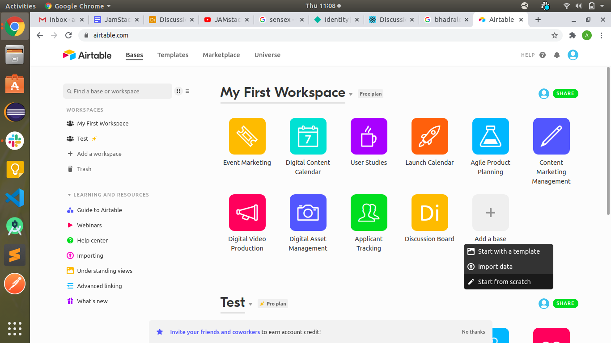
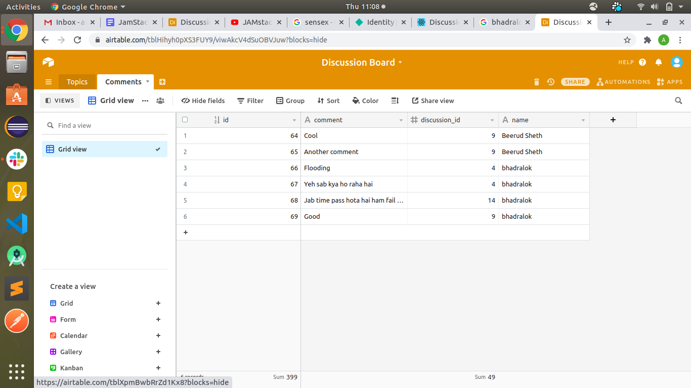
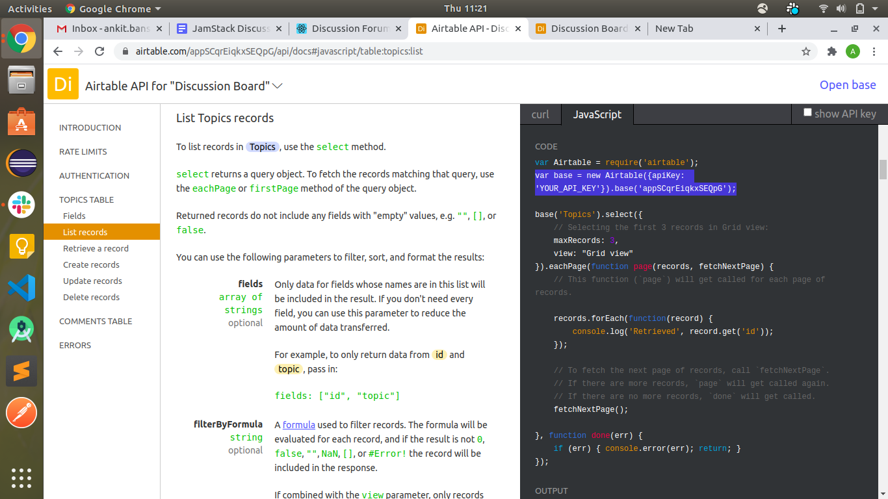

##JamStack Discussion Forum
(React, Airtable, Serverless and Netlify)
A simple discussion forum created using React, Airtable and Netlify.

[Live Demo](https://amazing-hugle-0e7701.netlify.app/)

Introduction:
The objective of this guide is to set up your (Jam)stack in minutes for your web application.
The stack:
Airtable: Serverless database
React: JavaScript UI framework
Netlify: Build, deploy and CI/CD with github
Netlify functions: Serverless computing
Netlify Identity: Login/Signup

Airtable Setup:

In airtable database equivalents are bases. Each base can have multiple tables.
1. Sign up for a free account
2. Create a new “base” (start from scratch)
3. Define two new table for storing discussion topics and comments

You will see a spreadsheet like user interface. Create the following tables and there columns as defined below:

Table1: Topics:
`id: Autonumber
topic: Single line text
name: Single line text`

Table2: Comments: 
`id: Autonumber
comment: Long text
discussion_id: Number (Integer(2))
name: Single line tex`

Note: The table/column names are case sensitive

Once you do that go to https://airtable.com/api and select your base and voila you will see an api documentation for your base and tables. 

There is a checkbox on top right to show your API key. Click on that and you will see your api key in the highlighted text of the screenshot and your base id like base("baseId").

Note: Airtable API’s have a Rate limit of only 5 requests per second as of now which make it unfit for applications like a discussion board. Alternatively, you can go with faunadb or dynamodb for such use cases.

Project Setup:
To quickly set up the project, clone the repository. 

Create a .env file containing the following environment variables

`AIRTABLE_API_KEY=<YOUR_API_KEY>
AIRTABLE_BASE_ID=<YOUR_BASE_ID>`

Serverless functions:

In the root directory of the repository you will see a netlify.toml file. It contains information that netlify will read to understand where our serverless functions and some redirection rules for our website.
Our netlify functions are stored in the functions folder of the root directory. You will see a file dboard.js which defines the one and only serverless function we are going to use.

Wait! You might be wondering if we will do a lot of operations for the discussion board like fetching/creating topics and fetching/posting comments. Why only one serverless function?

Ideally we should have created a single serverless function for each operation but serverless functions suffer with cold start issues if they are not used frequently. Read about that here.

To overcome that we do all the operations via a single function to avoid cold start issues with every operation. I would still recommend using separate functions for complex operations.

helper folder here contains the actual functions and some utilities required by our dboard function
dboard.js calls the desired function required for a particular event
airtable.js connects with your base and exports objects for your tables
formattedReturn.js utility which formats the response body
Remaining js files are corresponding to each operation

Once you have done this you have your serverless api ready to be used in your frontend but how do you test it? 
Netlify provided a command line interface for that. Do the following

npm install -g netlify-cli
netlify dev

This beautiful command does a few things for us:
Runs the serverless functions
Runs a web server for your site
Creates a proxy for front end and serverless functions to talk to each other on Port 8888

Note: We are able to use /api/* for our API because of the redirect configuration in the netlify.toml file.

Now go to http://localhost:8888/api/dboard/topics and you will see the list of topics if you have defined any in your airtable.

Check out the postman collection which defines all the API’s created using the serverless function here

Calling APIs from react:
Fetching topics:

	   const loadTopics = async () => {
	       setLoading(true);
	       try {
	           const res = await fetch('/api/dboard/topics');
	           const topics = await res.json();
	           setTopics(topics);
	           setLoading(false);
	       } catch (error) {
	           console.error(error);
	       }
	   };

Post comments:

       try {
           await fetch('/api/dboard/comment/' + currTopic.id, {
               method: 'POST',
               body: JSON.stringify({
                   comment,
                   name
               }),
           });
           resetForm();
           refreshComments();
       } catch (err) {
           alert("An error occurred while adding comment");
       }

Deploying on Netlify:
1. Create a netlify account if you don’t have one [here](https://app.netlify.com/signup).
2. Click on “New site from git button”, select your repository and branch
3. Write build command and name of publish directory

		Build command: CI= npm run build
		Publish directory: build

Click on advanced build settings and set your environment variables there:

Next click on deploy to start with the deployment.

Netlify Identity:
Once you have deployed the site you will see an identity tab for your site. Enable identity by visiting the tab.

I have created a react component NetlifyIdentity in `/src/components` folder of the project. Just place that component in your app.js  router as shown below.

		<Router>
		           <NetlifyIdentity/>
		           <Route exact path='/' component={Home} />
		           <Route exact path="/discussion/:id" component={Discussion} />
		</Router>

The above code snipped will initialize netlify identity with a global object netlifyIdentity
as soon as your application is loaded.

Now you can open login screen on a button click or any other action using `window.netlifyIdentity.open()`

The current user can be fetched using `window.netlifyIdentity.currentUser()`

To know more about netligy identity see [this](https://github.com/netlify/netlify-identity-widget).